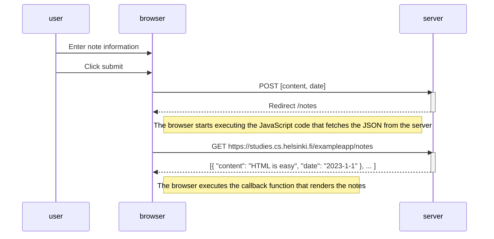

```mermaid
sequenceDiagram
    participant user
    participant browser
    participant server

    user->>browser: Enter note information
    user->>browser: Click submit
    
    browser->>server: POST [content, date]
    activate server
    server-->>browser: Redirect /notes
    deactivate server
    
    Note right of browser: The browser starts executing the JavaScript code that fetches the JSON from the server
    
    browser->>server: GET https://studies.cs.helsinki.fi/exampleapp/notes
    activate server
    server-->>browser: [{ "content": "HTML is easy", "date": "2023-1-1" }, ... ]
    deactivate server    

    Note right of browser: The browser executes the callback function that renders the notes 
```